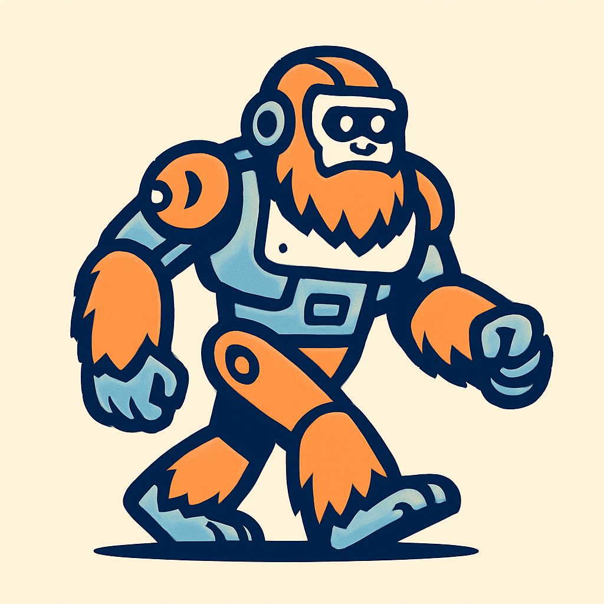

# Squatch

An exploration into simulation, sensor fusion, and SLAM.

## Locale
An esp32 firmware designed to poll data from an IMU and GNSS module.  It logs json messages to uart (for now).  esp-idf and freertos based.

## Brain
A dockerized ros2 setup.  Includes a node that reads uart messages, parses them, then inserts them into topics for processing.

## Setup
- esp-idf tooling, install via vscode
- [esp-idf qemu](https://docs.espressif.com/projects/esp-idf/en/stable/esp32/api-guides/tools/qemu.html)
- docker & docker compose

## Integration Testing
- Run ./scripts/qemu.sh
- cd brain && ./scripts/dev.sh up
- `./scripts/dev.sh shell`
- run nodes `ros2 run squatch_nodes esp_bridge_node host.docker.internal 5555`
- `ros2 topic echo /squatch/gnss` to show gnss data as it comes in

## TODO:

- General cleanup getting code up to standards
- ros2 services to consume data
- Telemetry module
- Switch to canbus